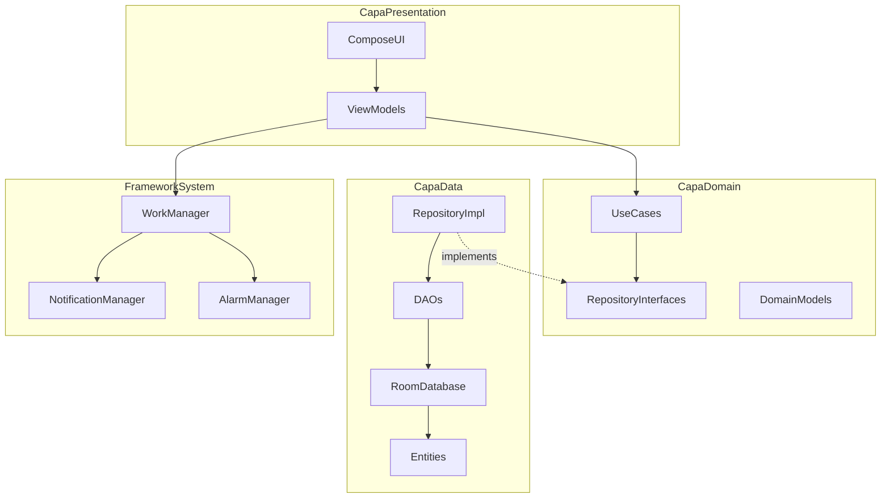

# Plan de Proyecto: Tareas Diarias

## 1. Resumen ejecutivo
- Aplicacion Android nativa en Kotlin para gestionar tareas periodicas con recordatorios y seguimiento.
- Stack principal: Jetpack Compose, MVVM + Clean Architecture, Room, Hilt, Coroutines/Flow.
- Enfoque de implementacion incremental por fases entregables y testeables.

## 2. Arquitectura propuesta



## 3. Estructura de carpetas completa

```text
app/src/main/java/com/dngarcia/tareasdiarias/
├── di/
│   ├── AppModule.kt
│   ├── DatabaseModule.kt
│   └── NotificationModule.kt
├── data/
│   ├── local/
│   │   ├── TareasDatabase.kt
│   │   ├── dao/
│   │   │   ├── TareaDao.kt
│   │   │   ├── CategoriaDao.kt
│   │   │   └── EjecucionDao.kt
│   │   ├── entity/
│   │   │   ├── TareaEntity.kt
│   │   │   ├── CategoriaEntity.kt
│   │   │   └── EjecucionEntity.kt
│   │   └── converter/
│   │       └── DateConverter.kt
│   └── repository/
│       ├── TareaRepositoryImpl.kt
│       └── CategoriaRepositoryImpl.kt
├── domain/
│   ├── model/
│   │   ├── Tarea.kt
│   │   ├── Categoria.kt
│   │   ├── Periodicidad.kt
│   │   └── EstadoTarea.kt
│   ├── repository/
│   │   ├── TareaRepository.kt
│   │   └── CategoriaRepository.kt
│   └── usecase/
│       ├── GetTareasHoyUseCase.kt
│       ├── CreateTareaUseCase.kt
│       ├── UpdateTareaUseCase.kt
│       ├── CompletarTareaUseCase.kt
│       ├── GetTareasByPeriodicidadUseCase.kt
│       ├── ValidarNombreUnicoUseCase.kt
│       └── CalcularProximaEjecucionUseCase.kt
├── presentation/
│   ├── navigation/AppNavigation.kt
│   ├── theme/{Color,Theme,Type}.kt
│   ├── common/components/
│   ├── today/{TodayScreen,TodayViewModel}.kt
│   ├── home/{HomeScreen,HomeViewModel}.kt
│   ├── tareas/{TareasScreen,TareasViewModel}.kt
│   ├── nueva_tarea/{NuevaTareaScreen,NuevaTareaViewModel}.kt
│   └── editar_tarea/{EditarTareaScreen,EditarTareaViewModel}.kt
├── notification/
│   ├── NotificationHelper.kt
│   ├── TareaReminderWorker.kt
│   ├── TareaConfirmWorker.kt
│   └── NotificationScheduler.kt
├── receiver/BootReceiver.kt
└── TareasDiariasApp.kt
```

## 4. Modelo de datos (pseudocodigo Room)

```text
@Entity Tarea:
  id: Long (PK, autoGenerate)
  nombre: String (unique)
  categoriaId: Long (FK -> Categoria.id)
  tipoPeriodicidad: Enum(DIARIA, SEMANAL, MENSUAL, SEMESTRAL, PERSONALIZADA, UNICA)
  diasPeriodicidad: Int? (solo PERSONALIZADA)
  notas: String
  fechaCreacion: LocalDateTime
  fechaProximaEjecucion: LocalDateTime? (null cuando UNICA se completa)
  cantidadPostergaciones: Int (default 0)
  estadoAlerta: Enum(NORMAL, PROXIMA, VENCIDA)
  mensajeAlerta: String?

@Entity Categoria:
  id: Long (PK, autoGenerate)
  nombre: String (unique)
  color: Int?

@Entity Ejecucion:
  id: Long (PK, autoGenerate)
  tareaId: Long (FK -> Tarea.id)
  fechaEjecucion: LocalDateTime
  completadaPorUsuario: Boolean
```

Relaciones:
- Tarea N:1 Categoria
- Tarea 1:N Ejecucion

## 5. Pantallas y componentes Compose principales
- Today: `Scaffold`, `LazyColumn`, `TareaItem`, `Checkbox`, FAB a Home.
- Home: tarjetas de acceso a Tareas, Categorias y futuras secciones.
- Tareas: Top 10, chips por periodicidad, chips de orden, boton "+" y listado principal.
- Nueva Tarea: formulario completo con validacion de nombre unico, selector de categoria y periodicidad.
- Editar Tarea: formulario precargado + confirmacion explicita para persistir cambios.

## 6. Fases de desarrollo y criterio de done
1. Fase 0 - Setup base: renombre paquete/proyecto, Hilt, Room, Navigation, WorkManager.  
   Done: compila y abre app con inyeccion funcionando.
2. Fase 1 - Data base: entidades, DAOs, repositorio CRUD.  
   Done: operaciones CRUD y tests de datos verdes.
3. Fase 2 - UI base: Today + Home con navegacion.  
   Done: flujo de navegacion estable.
4. Fase 3 - Nueva tarea: formulario + validaciones + guardado.  
   Done: crear tarea y verla en Today.
5. Fase 4 - Tareas: top 10, filtros y ordenamientos.  
   Done: filtros/orden aplicados correctamente.
6. Fase 5 - Editar tarea: edicion + popup confirmacion + cancelacion sin persistir.  
   Done: comportamiento exacto de guardado/descartar.
7. Fase 6 - Notificaciones: recordatorio previo y confirmacion posterior.  
   Done: notificaciones locales programadas y recibidas.
8. Fase 7 - Estados visuales: rojo/amarillo/verde, delay, ultima modificacion.  
   Done: estado visual consistente con reglas de negocio.
9. Fase 8 - Busqueda simple y avanzada.  
   Done: filtros por estado, fecha y categoria funcionando.
10. Fase 9 - Endurecimiento final: errores, edge cases, UX y cobertura extra.  
    Done: sin crashes relevantes y con suite minima de pruebas completa.

## 7. Decisiones tecnicas y justificacion
- Kotlin + Compose: stack moderno y oficial Android.
- MVVM + Clean: separacion clara de responsabilidades y testabilidad.
- Room: persistencia relacional local y queries robustas.
- Hilt: DI oficial con integracion directa a Android components.
- WorkManager + NotificationManager: ejecucion confiable en background.
- AlarmManager como fallback puntual para alarmas exactas.
- Coroutines + Flow: asincronia y reactividad nativas de Kotlin.
- Testing: JUnit, MockK y Compose UI Test para cubrir negocio, datos y UI.

## 8. Riesgos tecnicos y mitigaciones
- Restricciones de bateria/Doze: usar WorkManager y fallback con alarmas exactas para casos criticos.
- Permiso `POST_NOTIFICATIONS` (Android 13+): solicitud contextual y manejo de rechazo.
- `SCHEDULE_EXACT_ALARM` (Android 12+): solo cuando sea necesario y con degradacion controlada.
- Reboot del dispositivo: `BOOT_COMPLETED` para reprogramar trabajos pendientes.
- Cambios de schema: versionado desde inicio y migraciones explicitas de Room.

## 9. Checklist de configuracion inicial
- [ ] Renombrar paquete a `com.dngarcia.tareasdiarias`.
- [ ] Renombrar `rootProject.name` a "Tareas Diarias".
- [ ] Agregar plugins `kotlin-android`, `ksp` y `dagger.hilt.android.plugin`.
- [ ] Agregar dependencias Room, Hilt, Navigation Compose y WorkManager.
- [ ] Crear `Application` con `@HiltAndroidApp`.
- [ ] Crear modulos Hilt base.
- [ ] Agregar permisos: `POST_NOTIFICATIONS`, `SCHEDULE_EXACT_ALARM`, `RECEIVE_BOOT_COMPLETED`.
- [ ] Verificar build e instalacion en emulador/dispositivo.

## 10. PREGUNTAS ABIERTAS
- ¿Se mostrara historial de ejecuciones en UI v1?  
  Default: no, solo persistencia interna para futuras pantallas.
- ¿Cantidad maxima de categorias?  
  Default: sin limite.
- ¿Ventana default de recordatorio previo?  
  Default: 1 hora antes del vencimiento.
- ¿Confirmacion posterior sin respuesta?  
  Default: 3 reintentos cada 4 horas y luego marcar postergada.
- ¿UNICA completada mantiene proxima ejecucion?  
  Default: `fechaProximaEjecucion = null`.
